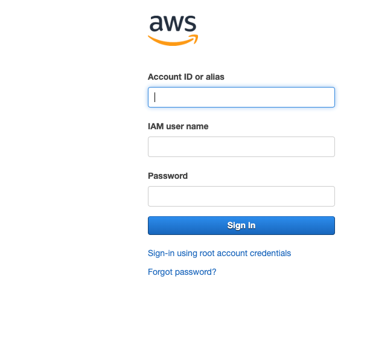
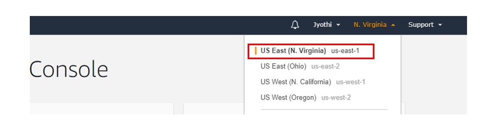
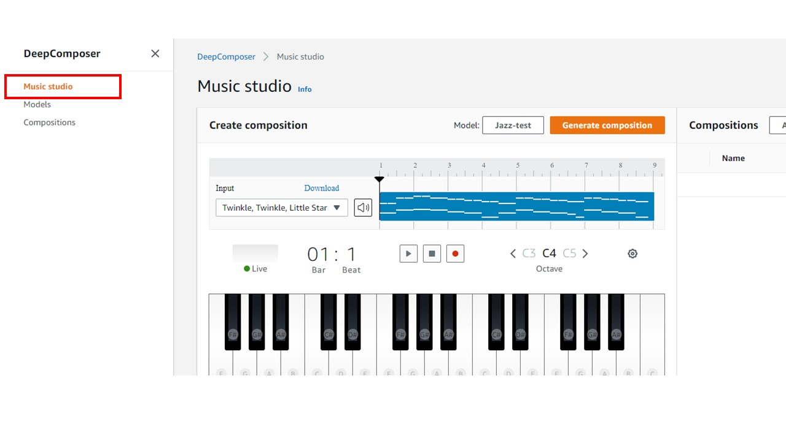
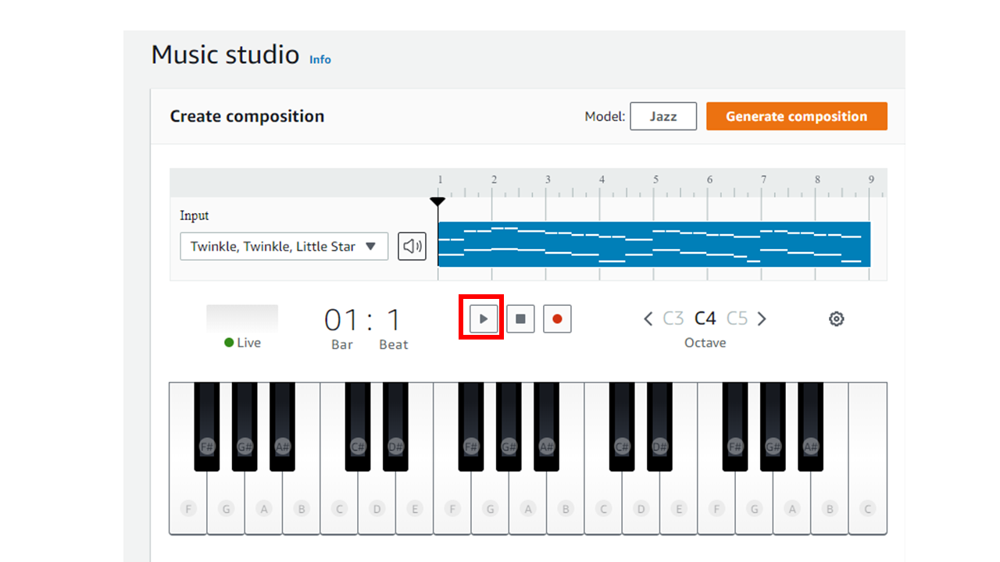
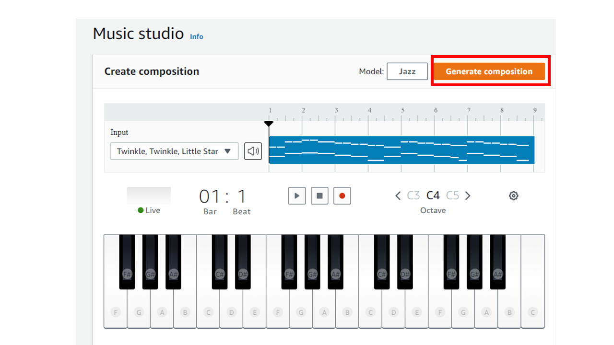
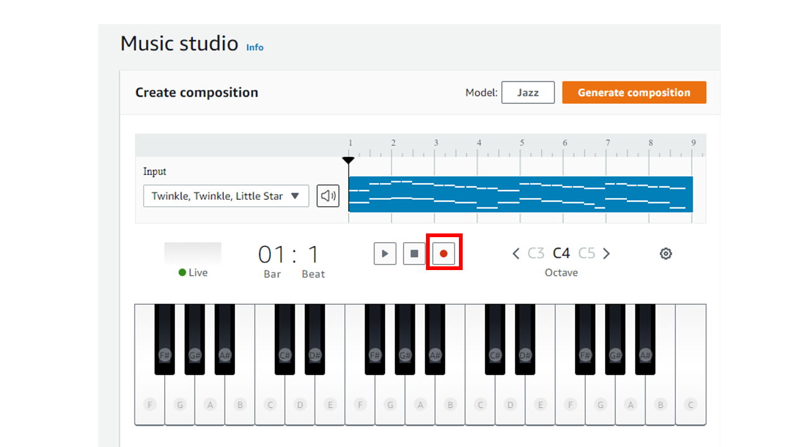
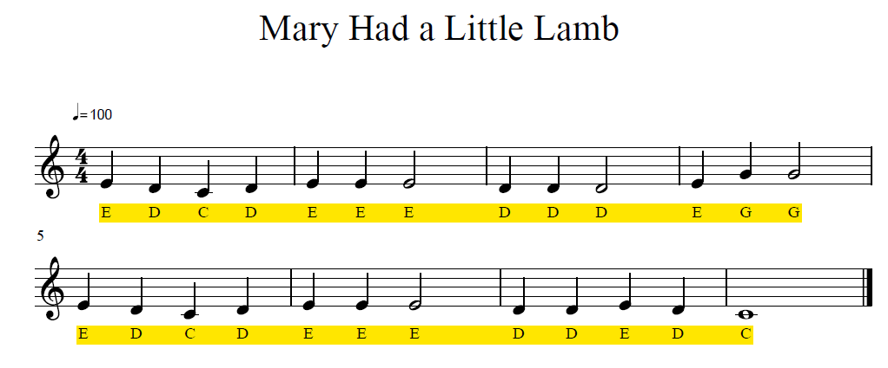
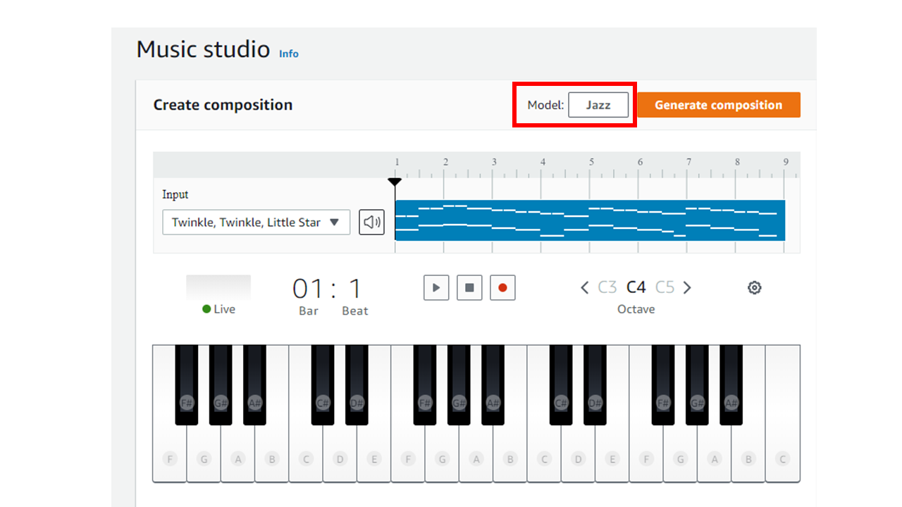

# Generate an Interface
## Prerequisites/Requirements
  - **Chrome Browser**: You will need to use the Chrome Browser for this exercise. If you do not have Chrome you can download it here: www.google.com/chrome
  - **AWS Account ID**: You will need an AWS Account ID to sign into the console for this project. To set up a new AWS Account ID, follow the directions here: [How do I create and activate a new Amazon Web Services account?](https://aws.amazon.com/premiumsupport/knowledge-center/create-and-activate-aws-account/)
  
Your AWS account includes free access for up to 500 inference jobs in the 12 months after you first use the AWS DeepComposer service. **You can use one of these free instances to complete the exercise at no cost.**

You can learn more about DeepComposer costs in the [AWS DeepComposer pricing documentation](https://aws.amazon.com/deepcomposer/pricing/)

## Access AWS DeepComposer console:
Click on DeepComposer link to get started: https://us-east-1.console.aws.amazon.com/deepcomposer

Enter AWS account ID, IAM Username and Password provided

Click **Sign In**

**Note: You must access the console in N.Virginia (us-east-1) AWS region** You can use the dropdown to select the correct region.

### Get Started:
Click **Music Studio** from the left navigation menu

*Click play* to play the default input melody

Click **Generate composition** to generate a composition. AI generated composition will be created

*Click play* to play the new AI generated musical composition

### Input melody:
Click record to start recording

Play the notes on the physical keyboard provided

Stop recording by clicking the record button again

Play the recorded music to verify the input. In case you don’t like recorded music, you may start recording again by clicking record

Select *Jazz** model from **Model**

lick **Generate Composition** to generate a composition based on the input melody you provided. Note: This step will take few minutes to generate a composition inspired by the chosen genre

Click play to play the composition and enjoy the AI generated music

Try experimenting with different genres or sample input melody

**Congratulations! You have learnt how to use pre-trained models to generate new music**
