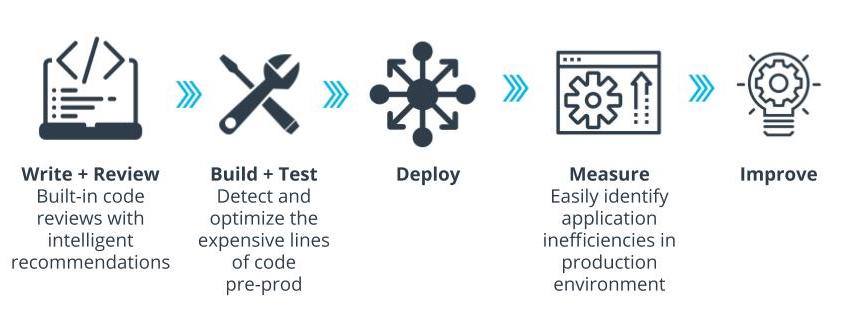
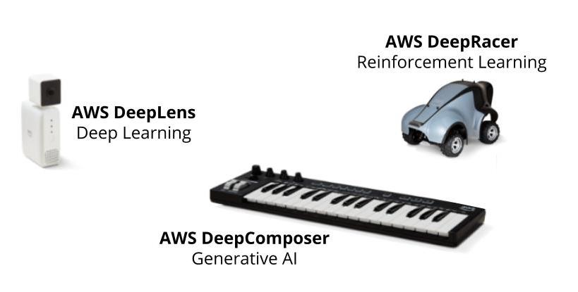
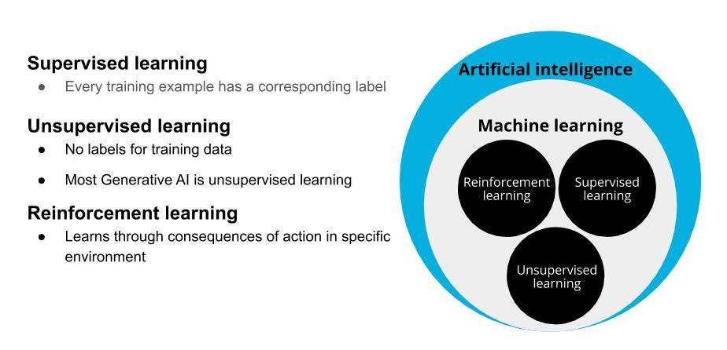

## Why AWS ?
  - AWS offers the broadest and deepest set of AI and ML services with unmatched flexibility.
  - You can accelerate your adoption of machine learning with AWS SageMaker. Models that previously took months and required specialized expertise can now be built in weeks or even days.
  - AWS offers the most comprehensive cloud offering optimized for machine learning.
  - More machine learning happens at AWS than anywhere else.

## More Relevant Enterprise Search With Amazon Kendra
  - Natural language search with contextual search results
  - ML-optimized index to find more precise answers
  - 20+ Native Connectors to simplify and accelerate integration
  - Simple API to integrate search and easily develop search applications
  - Incremental learning through feedback to deliver up-to-date relevant answers
## Online Fraud Detection with Amazon Fraud Detector
  - Pre-built fraud detection model templates
  - Automatic creation of custom fraud detection models
  - One interface to review past evaluations and detection logic
  - Models learn from past attempts to defraud Amazon
  - Amazon SageMaker integration
## Amazon Code Guru

## Better Insights And Customer Service With Contact Lens
  - Identify common call types
  - Identify recurring themes based on customer call feedback
  - Alert supervisors when customers are having a poor experience
  - Assist agents with a knowledge base to answer questions as they are being asked

## How to Get Started?

  - [AWS DeepLens](https://aws.amazon.com/deeplens/): deep learning and computer vision
  - [AWS DeepRacer](https://aws.amazon.com/deepracer/) and the [AWS DeepRacer League](https://aws.amazon.com/deepracer/league/): reinforcement learning
  - [AWS DeepComposer](https://aws.amazon.com/deepcomposer/): Generative AI.
  - [AWS ML Training and Certification](https://aws.amazon.com/training/learning-paths/machine-learning/): Curriculum used to train Amazon developers
  - Partnerships with Online Learning Providers: Including this course and the Udacity [AWS DeepRacer](https://www.udacity.com/course/aws-deepracer--ud014) course!

## Machine Learning Techniques
  1. **Supervised Learning:** Models are presented wit input data and the desired results. The model will then attempt to learn rules that map the input data to the desired results.
  2. **Unsupervised Learning:** Models are presented with datasets that have no labels or predefined patterns, and the model will attempt to infer the underlying structures from the dataset. Generative AI is a type of unsupervised learning.
  3. **Reinforcement learning:** The model or agent will interact with a dynamic world to achieve a certain goal. The dynamic world will reward or punish the agent based on its actions. Overtime, the agent will learn to navigate the dynamic world and accomplish its goal(s) based on the rewards and punishments that it has](./img/types-of-ml.jpg) received.
  

### Generative AI
Generative AI is one of the biggest recent advancements in artificial intelligence technology because of its ability to create something new. It opens the door to an entire world of possibilities for human and computer creativity, with practical applications emerging across industries, from turning sketches into images for accelerated product development, to improving computer-aided design of complex objects. It takes two neural networks against each other to produce new and original digital works based on sample inputs.

## AWS Composer and Generative AI
AWS Deep Composer uses Generative AI, or specifically Generative Adversarial Networks (GANs), to generate music. GANs pit 2 networks, a generator and a discriminator, against each other to generate new content.

The best way we’ve found to explain this is to use the metaphor of an orchestra and conductor. In this context, the generator is like the orchestra and the discriminator is like the conductor. The orchestra plays and generates the music. The conductor judges the music created by the orchestra and coaches the orchestra to improve for future iterations. So an orchestra, trains, practices, and tries to generate music, and then the conductor coaches them to produced more polished music.

### AWS DeepComposer Workflow
  1. Use the AWS DeepComposer keyboard or play the virtual keyboard in the AWS DeepComposer console to input a melody.
  2. Use a model in the AWS DeepComposer console to generate an original musical composition. You can choose from jazz, rock, pop, symphony or Jonathan Coulton pre-trained models or you can also build your own custom genre model in Amazon SageMaker.
  3. Publish your tracks to SoundCloud or export MIDI files to your favorite Digital Audio Workstation (like Garage Band) and get even more creative.
  ### Compose Music with AWS DeepComposer Models
Now that you know a little more about AWS DeepComposer including its workflow and what GANs are, let’s compose some music with AWS DeepComposer models. We’ll begin this demonstration by listening to a sample input and a sample output, then we’ll explore DeepComposer’s music studio, and we’ll end by generating a composition with a 4 part accompaniment.

1. To get to the main AWS DeepComposer console, navigate to [AWS DeepComposer](https://console.aws.amazon.com/deepcomposer/home?region=us-east-1). Make sure you are in the US East-1 region.
2. Once there, click on **Get started**
3. In the left hand menu, select **Music studio** to navigate to the DeepComposer music studio
4. To generate music you can use a virtual keyboard or the physical AWS DeepComposer keyboard. For this lab, we’ll use the virtual keyboard.
5. To view sample melody options, select the drop down arrow next to **Input**
6. Select **Twinkle, Twinkle, Little Star**
7. Next, choose a model to apply to the melody by clicking **Select model**
8. From the sample models, choose **Rock** and then click **Select model**
9. Next, select **Generate composition**. The model will take the 1 track melody and create a multitrack composition (in this case, it created 4 tracks)
10. Click **play** to hear the output

Now that you understand a little about the DeepComposer music studio and created some AI generated music, let’s move on to an exercise for generating an interface. There, you’ll have an opportunity to clone a pre-trained model to create your AI generated music!
