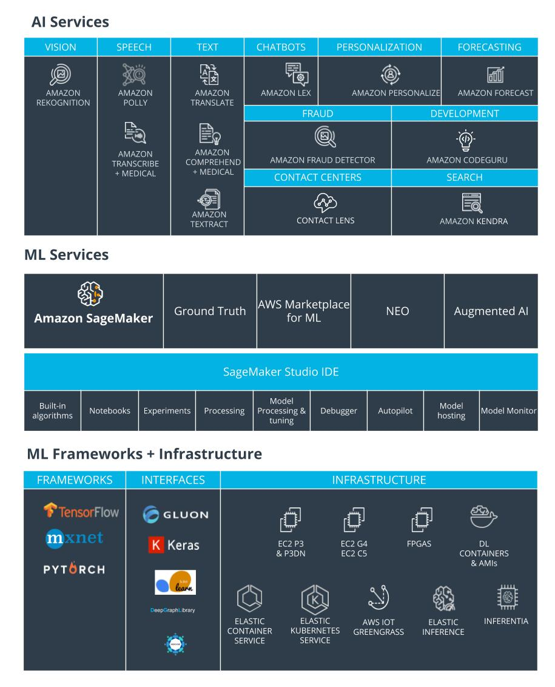

## Why AWS ?
  - AWS offers the broadest and deepest set of AI and ML services with unmatched flexibility.
  - You can accelerate your adoption of machine learning with AWS SageMaker. Models that previously took months and required specialized expertise can now be built in weeks or even days.
  - AWS offers the most comprehensive cloud offering optimized for machine learning.
  - More machine learning happens at AWS than anywhere else.

## More Relevant Enterprise Search With Amazon Kendra
  - Natural language search with contextual search results
  - ML-optimized index to find more precise answers
  - 20+ Native Connectors to simplify and accelerate integration
  - Simple API to integrate search and easily develop search applications
  - Incremental learning through feedback to deliver up-to-date relevant answers
## Online Fraud Detection with Amazon Fraud Detector
  - Pre-built fraud detection model templates
  - Automatic creation of custom fraud detection models
  - One interface to review past evaluations and detection logic
  - Models learn from past attempts to defraud Amazon
  - Amazon SageMaker integration
## Amazon Code Guru

## Better Insights And Customer Service With Contact Lens
  - Identify common call types
  - Identify recurring themes based on customer call feedback
  - Alert supervisors when customers are having a poor experience
  - Assist agents with a knowledge base to answer questions as they are being asked

## How to Get Started?

  - [AWS DeepLens](https://aws.amazon.com/deeplens/): deep learning and computer vision
  - [AWS DeepRacer](https://aws.amazon.com/deepracer/) and the [AWS DeepRacer League](https://aws.amazon.com/deepracer/league/): reinforcement learning
  - [AWS DeepComposer](https://aws.amazon.com/deepcomposer/): Generative AI.
  - [AWS ML Training and Certification](https://aws.amazon.com/training/learning-paths/machine-learning/): Curriculum used to train Amazon developers
  - Partnerships with Online Learning Providers: Including this course and the Udacity [AWS DeepRacer](https://www.udacity.com/course/aws-deepracer--ud014) course!

## Machine Learning Techniques
  1. **Supervised Learning:** Models are presented wit input data and the desired results. The model will then attempt to learn rules that map the input data to the desired results.
  2. **Unsupervised Learning:** Models are presented with datasets that have no labels or predefined patterns, and the model will attempt to infer the underlying structures from the dataset. Generative AI is a type of unsupervised learning.
  3. **Reinforcement learning:** The model or agent will interact with a dynamic world to achieve a certain goal. The dynamic world will reward or punish the agent based on its actions. Overtime, the agent will learn to navigate the dynamic world and accomplish its goal(s) based on the rewards and punishments that it has](./img/types-of-ml.jpg) received.
  

### Generative AI
Generative AI is one of the biggest recent advancements in artificial intelligence technology because of its ability to create something new. It opens the door to an entire world of possibilities for human and computer creativity, with practical applications emerging across industries, from turning sketches into images for accelerated product development, to improving computer-aided design of complex objects. It takes two neural networks against each other to produce new and original digital works based on sample inputs.

[Generative AI](./img/generative-ai.jpg)
