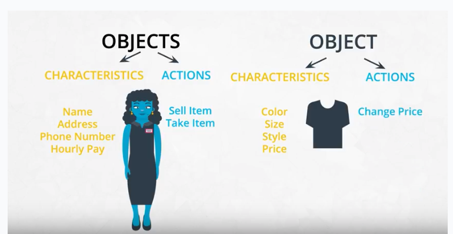

# Object-Oriented Programming
## Lesson Outline
  - Object-oriented programming syntax
    - procedural vs object-oriented programming
    - classes, objects, methods and attributes
    - coding a class
    - magic methods
    - inheritance
  - Using object-oriented programming to make a Python package
    - making a package
    - tour of scikit-learn source code
    - putting your package on PyPi
## Why Object-Oriented Programming?
Object-oriented programming has a few benefits over procedural programming, which is the programming style you most likely first learned. As you'll see in this lesson,

  - object-oriented programming allows you to create large, modular programs that can easily expand over time;
  - object-oriented programs hide the implementation from the end-user.
Consider Python packages like **Scikit-learn, pandas, and NumPy.** These are all Python packages built with object-oriented programming. Scikit-learn, for example, is a relatively large and complex package built with object-oriented programming. This package has expanded over the years with new functionality and new algorithms.

When you train a machine learning algorithm with Scikit-learn, you don't have to know anything about how the algorithms work or how they were coded. You can focus directly on the modeling.

Here's an example taken from the [Scikit-learn website](https://scikit-learn.org/stable/modules/svm.html):
```python
from sklearn import svm
X = [[0, 0], [1, 1]]
y = [0, 1]
clf = svm.SVC()
clf.fit(X, y)
```
How does Scikit-learn train the SVM model? You don't need to know because the implementation is hidden with object-oriented programming. If the implementation changes, you as a user of Scikit-learn might not ever find out. Whether or not you SHOULD understand how SVM works is a different question.

## Objects are defined by characteristics and actions
Here is a reminder of what is a characteristic and what is an action.

### Characteristics and Actions in English Grammar
Another way to think about characteristics and actions is in terms of English grammar. A characteristic would be a noun. On the other hand, an action would be a verb.

Let's pick something from the real-world: a dog. A few characteristics could be the dog's weight, color, breed, and height. These are all nouns. What actions would a dog take? A dog can bark, run, bite and eat. These are all verbs.
