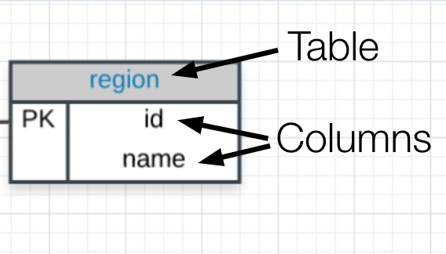

## Entity Relationship Diagrams

An **entity relationship diagram** (ERD) is a common way to view data in a database. Below is the ERD for the database we will use from Parch & Posey. These diagrams help you visualize the data you are analyzing including:

1. The names of the tables.
2. The columns in each table.
3. The way the tables work together.

**You can think of each of the boxes below as a spreadsheet.**

### What to Notice

In the Parch & Posey database there are five tables (essentially 5 spreadsheets):

1. web_events
2. accounts
3. orders
4. sales_reps
5. region

You can think of each of these tables as an individual spreadsheet. Then the columns in each spreadsheet are listed below the table name. For example, the region table has two columns: `id` and `name`. Alternatively the **web_events** table has four columns.

The "crow's foot" that connects the tables together shows us how the columns in one table relate to the columns in another table. In this first lesson, you will be learning the basics of how to work with SQL to interact with a single table. In the next lesson, you will learn more about why these connections are so important for working with SQL and relational databases.
