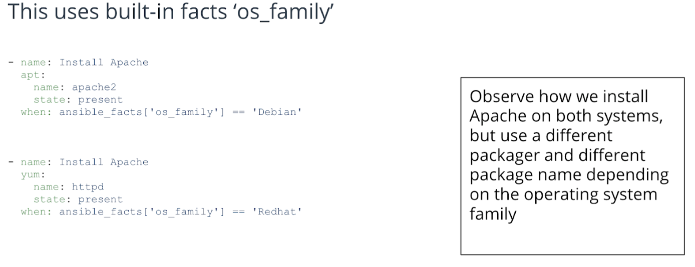

## Ansible Overview
  - Leverages YAML (yet another modeling language) and JSON (Javascript object notation)
  - Agent-less language which uses SSH (secure shell) to connect to servers
  - Light-weight, but managing large clusters is slow
  - Written in Python, Ruby and Powershell
## Configuration Management Desired State
Idempotency: “The property of certain operations in mathematics and computer science whereby they can be applied multiple times without changing the result beyond the initial application.”
Source: [https://en.wikipedia.org/wiki/Idempotence](https://en.wikipedia.org/wiki/Idempotence)
## Ansible Templates
  - Ansible templates enable you to apply configuration files which are customized to fit the application
  - Variables are abstracted using the format: `{{ VARIABLE_NAME }}`
## Templates Example Code
File: repo.conf.j2
```
server {
        listen   80;
        server_name  {{ SERVER_NAME }};
        root   {{ REPO_PATH }};
        location / {
                index  index.php index.html index.htm;
                autoindex on;    #enable listing of directory index
        }
}
```
## Apply Template
```
- name: generate all configmap configs
  template:
      src: repo.conf.j2
      dest: /etc/nginx/conf.d/repo.conf
      owner: root
      group: root
      mode: 0744
```

## Conditionals Register
Set an Ansible variable to the output of the module
```
- name: How long has the server been up
  shell: uptime
  register: sys_uptime
```
# Ansible Conditionals When Clause

## Conditionals Classification
### Built-in Ansible Variables
  - To see every built-in variable for the system you are using (every host is different) (change localhost to the host you are checking):
`$ ansible -m setup localhost`
  - Some common ones:
    - ansible_hostname
    - ansible_all_ipv4_addresses
    - ansible_architecture
    - ansible_kernel
## Roles Define
## File Structure of a Role
Each role is contained in a subdirectory:
`roles/name_of_role`

Containing additional directories:
  - Tasks
  - Templates
  - Vars
  - Files

## Ansible Role Assignment
To include a role:
```
    - name: Initialize Vault Server
      include_role:
        name: vault
```        
## Running Ansible Playbook with Inventory
`ansible-playbook -i my_hosts -a SE_LINUX=”true” init_servers.yaml`

