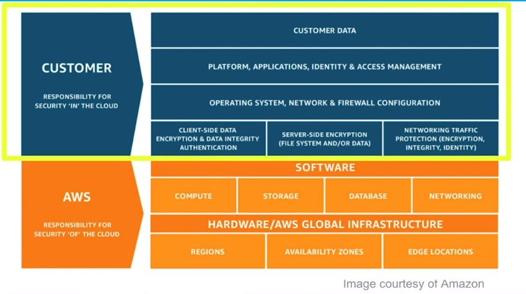

# Cloud Computing
Cloud Computing is the delivery of IT resources over the Internet. The cloud is like a virtual data center accessible via the Internet that allows you to manage:

- Storage services likes databases
- Servers, compute power, networking
- Analytics, artificial intelligence, augmented reality
- Security services for data and applications

## Characteristics of Cloud Computing
- Pay as you go - You pay only for what you use and only when your code runs.
- Autoscaling - The number of active servers can grow or shrink based on demand.
- Serverless - Allows you to write and deploy code without having to worry about the underlying infrastructure.

# Types of Cloud Computing
## Infrastructure-as-a-Service (IaaS)
The provider supplies virtual server instances, storage, and mechanisms for you to manage servers.

## Platform-as-a-Service (PaaS)
A platform of development tools hosted on a provider's infrastructure.

## Software-as-a-Service (SaaS)
A software application that runs over the Internet and is managed by the service provider.

# Cloud Deployment Models

## Public Cloud
A public cloud makes resources available over the Internet to the general public.
## Private Cloud
A private cloud is a proprietary network that supplies services to a limited number of people.
## Hybrid Cloud
A hybrid model contains a combination of both a public and a private cloud.

*The hybrid model is a growing trend in the industry for those organizations that have been slow to adopt the cloud due to being in a heavily regulated industry. The hybrid model gives organizations the flexibility to slowly migrate to the cloud.*

# Benefits
There are several benefits to the cloud.

- Stop guessing about capacity.
- Avoid huge capital investments up front.
- Pay for only what you use.
- Scale globally in minutes.
- Deliver faster.

# Providers
- Amazon Web Services (AWS)
- Google Cloud Platform (GCP)
- Microsoft Azure

# Amazon Web Services is a Market Leader
There are several popular cloud platforms; however, Amazon Web Services (AWS) leads the public cloud infrastructure by currently holding the highest market share and the largest number of data centers and services. AWS routinely adds new services and invests billions of dollars in the overall platform and infrastructure.

# Shared Responsibility Model
AWS is responsible for security **OF** the cloud, we are responsible for security **IN** the cloud.

## Examples
### AWS is responsible for:
- Securing edge locations
- Monitoring physical device security
- Providing physical access control to hardware/software
- Database patching
- Discarding physical storage devices
### You are responsible for:
- Managing AWS Identity and Access Management (IAM)
- Encrypting data
- Preventing or detecting when an AWS account has been compromised
- Restricting access to AWS services to only those users who need it
