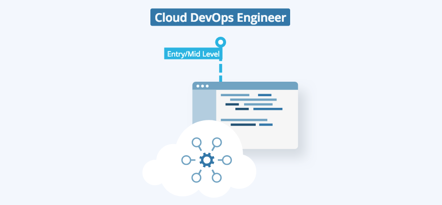
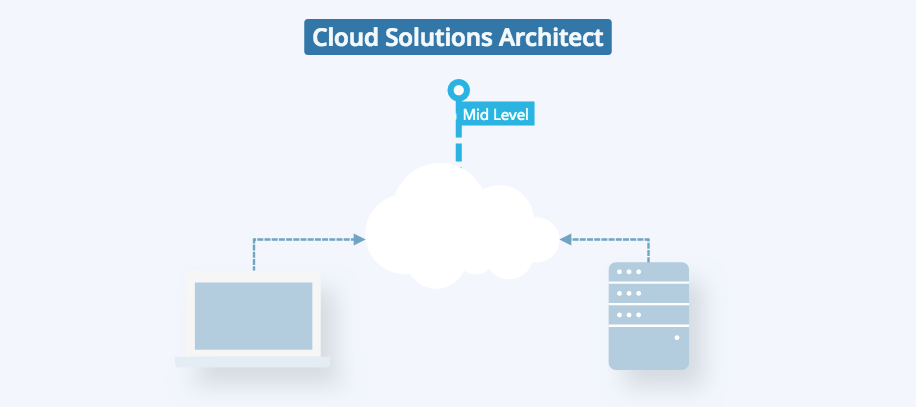
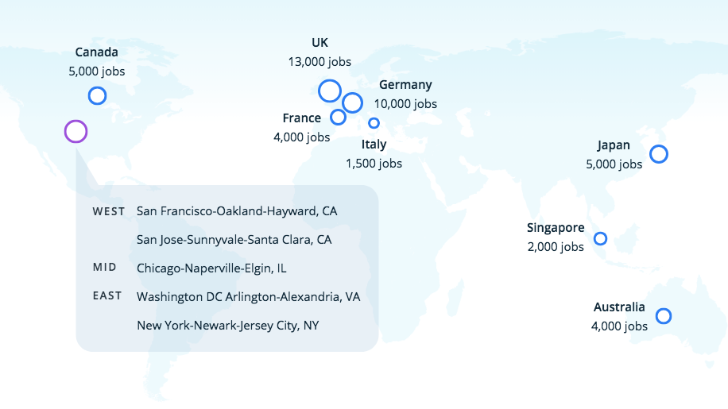

# Cloud Jobs

## What is Cloud Computing?
Today, all companies are adopting cloud computing to enable their digital transformation. **The cloud tech services market is projected to grow 17.3% ($206 billion) in 2019.**

Cloud services such as Amazon Web Services (AWS), Microsoft Azure, and Google Cloud appeal to many organizations because of features such as **pay-per-use, ability to scale up or down based on usage, self-service**, and more.

All these benefits lead to much lower costs, faster time-to-market and better service quality compared with traditional methods.

The growth of this technology has created incredible demand for Cloud computing jobs, from Cloud developers and Cloud DevOps roles to more specialized roles such as solutions architects and Cloud security engineers. Regardless of the role, Cloud computing skills are in **high demand** and have the potential to **impact almost every industry**.

## Cloud Computing Job Profiles

### Job Duties:

- Designing and developing secure, scalable cloud applications, and products.
- Assisting in developing automated tooling for deployment and maintenance.
- Defining and documenting best practices and strategies regarding application deployment and infrastructure maintenance.

### Required Skills:

- Programming Languages (e.g., Python)
- Web Services & API
- Networking, Storage, Compute, Security on Cloud
- Deploying Software in Cloud
- Web Development (i.e. HTML, CSS)
- Virtualization & Containers

### Job Duties:

- Building and scaling services in a cloud.
- Configuration management.
- Building automated systems/infrastructure, and develop pipelines to make remote updates to software eliminating any effort for users.

### Required Skills:

- Programming Language (i.e. Python)
- Infrastructure as Code
- CI/CD Tools (Jenkins)
- Monitor Software & Infrastructure
- Orchestration (i.e. Kubernetes)
- Infrastructure Automation (i.e. Ansible)

### Job Duties:

- Delivering solution architecture to engineering teams, communicating their value to ensure good implementation.
- Offering guidance in infrastructure movement techniques, such as bulk application transfers into the Cloud (lift or shift, or adopting cloud-native approach).
- Driving experiments to evaluate new technologies and methodologies to accelerate project delivery.

### Required Skills:

- OS Concepts (e.g. Linux)
- Networking, Storage & Security Fundamentals
- Application and Infrastructure Architecture & Design principles
- Automation & Orchestration
- IT Governance

## Where is demand for Cloud jobs?

