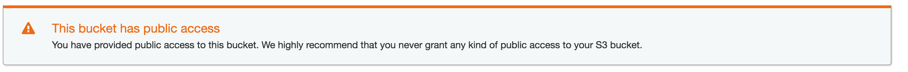

# Deploy Static Website on AWS
## # Create S3 Bucket
1. Navigate to the “AWS Management Console” page, type “S3” in the “Find Services” box and then select “S3”.

2. The Amazon S3 dashboard displays. Click “Create bucket”.

3.Enter a “Bucket name” and click “Next”. Note: Bucket names must be globally unique.

4. Click “Next” again to skip over “Step 2: Configure Options”.
5. On “Step 3: Set Permissions”, uncheck “Block all public access”.

6. Click “Next” and click “Create bucket”.
7. Once the bucket is created, click on the name of the bucket to open the bucket to the contents.


the interface changed in 2020 the interface looks like this


## # Upload files to S3 Bucket
1. Once the bucket is open to its contents, click the “Upload” button.


2. Click the “Add Files” button and drag and drop files and folders from your local computer to the S3 bucket and select “Upload”. Note: Upload the downloaded student-ready starter code files.


## # Secure Bucket via IAM
1. Click on the “Permissions” tab.

2. Click on “Bucket Policy” and enter the bucket policy below replacing “your-website” with the name of your bucket and click “Save”.
```JSON
{
  "Version":"2012-10-17",
  "Statement":[
    {
      "Sid":"AddPerm",
      "Effect":"Allow",
      "Principal": "*",
      "Action":["s3:GetObject"],
      "Resource":["arn:aws:s3:::your-website/*"]
    }
  ]
}
```


You will see warnings about making your bucket public, but this step is required for static website hosting.



## # Configure S3 Bucket
1. Click on the “Properties” tab and then click on “Static website hosting”.

2. Click on “Use this bucket to host a website”.

3. For both “Index document” and “Error document”, enter “index.html” and click “Save”.
