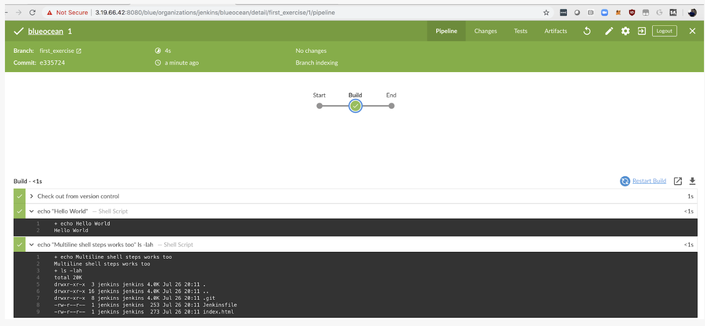
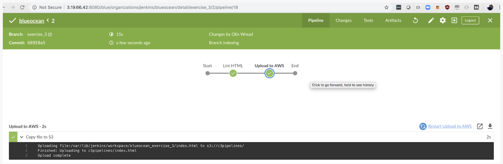

### Practice Exercise 1
**Working through these exercises will give you valuable practice for your project work!**

To practice your skills with deployment and pipelines, please do the following:

  - Set up a “Hello World” pipeline in Blue Ocean. 
  - Screenshot a successful run and compare it to my screenshot below.

The code for a “Hello World” pipeline is shown here:

```pipeline {
  agent any 
  stages {
    stage(‘Build’) {
      steps {
        sh ‘echo “Hello World”’
        sh ‘“
                  echo “Multiline shell steps works too”
                  ls -lah
               “‘
      }
    }
  }
}
```
  


### Practice Exercise 2

  - Install “lint” onto your Jenkins Master. This is to check the HTML code for malformed tags.

`sudo apt install tidy`
  - Set up a Lint job. 
  - Capture a screenshot after a successful Lint check of your html code, and compare it to the screenshot below.

```pipeline {
    agent any
    stages {
      stage(‘Lint HTML’) {
        steps {
          sh ‘tidy -q -e *.html’
        }
      }
    }
}
```
  


### Practice Exercise 3
  - Install Jenkins plugin AWS CodePipeline.
  - Set up your AWS credentials with your access key and secret access key in Credentials.
  - Create your S3 bucket (must be unique).
  - Set up your pipeline. Note: your bucket name can’t be the same as mine. 
  - Screenshot a successful run and compare it to mine below.

Here is the Pipeline code for performing the Tidy check:

```pipeline {
    agent any
    stages {
      stage(‘Lint HTML’) {
        steps {
          sh ‘tidy -q -e *.html’
        }
      stage(‘Upload to AWS’) {
        steps {
          withAWS(region:’us-east-1’,credentials:’blueocean’) {
            s3Upload(pathStyleAccessEnabled:true, payloadSigningEnabled: true, file:’index.html’, bucket:’c3pipelines’)
          }
        }
      }
    }
}
```

  

