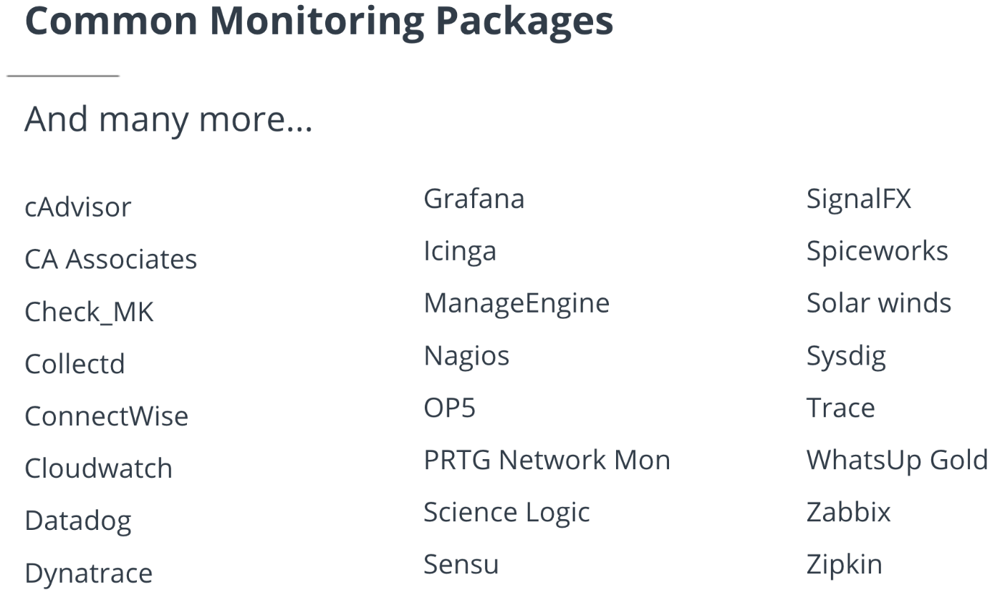
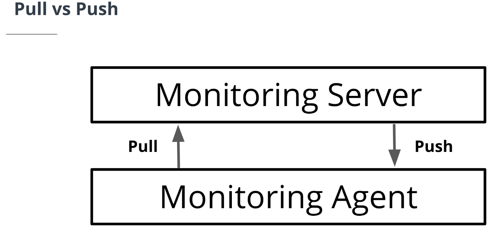
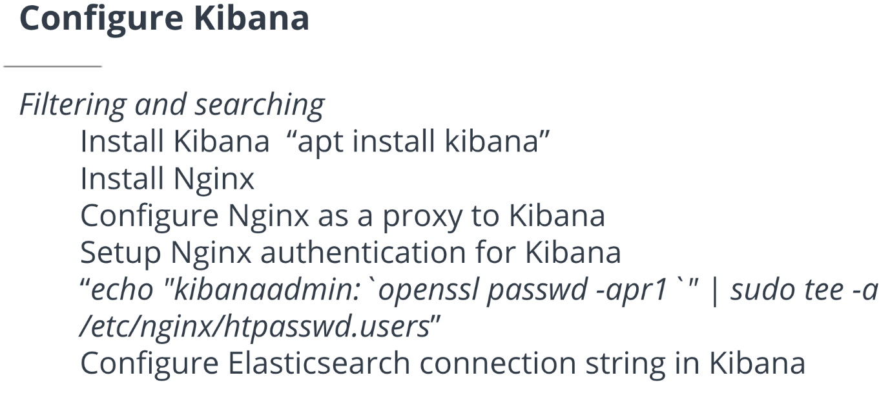

## Monitoring Overview
### Here’s what you’ll learn in this lesson on monitoring:
  - Monitoring software
  - Push vs pull monitoring
  - Prometheus quick setup
  - Adding a server to Prometheus
  - Adding an attribute to Prometheus
  - Prometheus dashboards
  - Log monitoring with ELK stack
  - Alerts
### Common Monitoring Packages

### Pull vs. Push


## Prometheus
In Greek mythology, Prometheus (/prəˈmiːθiːəs/; Greek: Προμηθεύς, pronounced [promɛːtʰéu̯s], possibly meaning "forethought")[1] is a Titan, culture hero, and trickster figure who is credited with the creation of man from clay, and who defies the gods by stealing fire and giving it to humanity - [https://en.wikipedia.org/wiki/Prometheus](https://en.wikipedia.org/wiki/Prometheus)

In the world of Cloud DevOps, Prometheus is a very useful, flexible tool for our monitoring.

### Prometheus Quickstart
[https://github.com/cloudalchemy/ansible-prometheus](https://github.com/cloudalchemy/ansible-prometheus)
  - Install Ansible
  - Git clone Ansible-prometheus
  - Install pip and tox
  - Setup role
  - Create inventory file
  - Create main.yaml playbook
  - Run playbook
  - Install node exporter and configure
  - Check web interface
### Prometheus Grafana
(Note: You can scroll to the right to see all the code in the box below.)
```
curl -LO https://s3-us-west-2.amazonaws.com/grafana-releases/release/grafana_5.1.4_amd64.deb ;
sudo apt-get install -y adduser libfontconfig ;
sudo dpkg -i grafana_5.1.4_amd64.deb ;
sudo systemctl start grafana-server ;
sudo systemctl enable grafana-server
```
### ELK Represents:
  - **Elasticsearch:** Log aggregator 
  - **Logstash:** Agent to send logs into Elasticsearch
  - **Kibana:** GUI web interface to search logs
(No, ELK has nothing to do with this fellow below!)
### ELK Stack Quickstart
  - Clone this Github repo: https://github.com/elastic/ansible-elasticsearch
  - Create inventory file
  - Create main.yaml playbook
  - Run the playbook
  - Configure Elasticsearch password for user “elastic” (default):
    - /usr/share/elasticsearch/bin/elasticsearch-keystore add "bootstrap.password"
### Configure Kibana

### Configure Logstash
Sending logs to Elasticsearch
  - Login to Kibana
  - Install Logstash
  - Configure connection string to Elasticsearch
  - Check Kibana for logs


## Pro Tips on Using the ELK Stack
  - The ELK stack requires more memory than everything else in this course.
  - The standard config recommends 2GB. This is why we migrate to a larger instance. 
  - It may also be necessary to stop anything else that you have set up in this course (i.e. Jenkins, Prometheus, and Grafana). 
  - If the Ansible installation script for Elasticsearch takes too long (more than 5 minutes for a single item) you may have run out of memory.
  - Do not be alarmed, just restart the EC2 instance either through the command line, or if necessary in the AWS web console.

### Monitoring Further Research
To learn how to set up alerts and notifications with ELK stack, please refer to the following:
[https://www.elastic.co/what-is/elasticsearch-alerting](https://www.elastic.co/what-is/elasticsearch-alerting)
